# 🚀 Google Products — Full Potential Strategy for HMS SaaS & Company Growth

> **Goal**: আপনার Google Credits সর্বোচ্চ ব্যবহার করে HMS SaaS প্রোডাক্ট এবং পুরো কোম্পানিকে 100x speed-এ গ্রো করা।

---

## 📊 Executive Summary

আপনার বর্তমান স্ট্যাক Cloudflare-ভিত্তিক। Google products কে **replace** হিসেবে না, বরং **complement** হিসেবে ব্যবহার করুন — বিশেষত AI/ML, Analytics, Marketing, এবং Business Operations এর জন্য।

```mermaid
graph TD
    A[Google Credits] --> B[🤖 AI/ML - Gemini & Vertex]
    A --> C[📊 Analytics & BI]
    A --> D[📢 Marketing & Growth]
    A --> E[⚙️ DevOps & Infrastructure]
    A --> F[🏢 Business Operations]
    A --> G[🔒 Security & Compliance]
    
    B --> B1[Medical AI - Gemini Pro]
    B --> B2[Document AI - Prescription OCR]
    B --> B3[Speech-to-Text - Voice Notes]
    B --> B4[Translation API - Multi-lingual]
    
    C --> C1[BigQuery - Data Analytics]
    C --> C2[Looker Studio - Dashboards]
    C --> C3[GA4 - Product Analytics]
    
    D --> D1[Google Ads]
    D --> D2[Google Business Profile]
    D --> D3[YouTube Ads]
    D --> D4[Google Maps Platform]
    
    E --> E1[Cloud Build - CI/CD]
    E --> E2[Artifact Registry - Packages]
    E --> E3[Firebase - Mobile Push]
    
    F --> F1[Google Workspace]
    F --> F2[Google Meet API]
    F --> F3[Google Calendar API]
```



---

## 🤖 1. AI/ML — সবচেয়ে বড় Impact (HIGH PRIORITY)

### 1A. Gemini API (Medical AI Upgrade)

> **বর্তমান**: OpenRouter API ব্যবহার করছেন AI Assistant-এ।  
> **Upgrade**: Gemini 2.0 Pro/Flash ব্যবহার করুন — আরও সস্তা, দ্রুত, এবং larger context window।

| Feature | Current (OpenRouter) | Google (Gemini) | Benefit |
|---------|---------------------|-----------------|---------|
| Medical Chat | Generic LLM | Gemini 2.0 Pro | 1M token context, better Bengali |
| PDF Analysis | Basic | Gemini multimodal | Image+PDF natively |
| Cost | ~$5-15/1M tokens | **$1.25/1M tokens** (Flash) | 4-10x সস্তা |
| Speed | Variable | <1s (Flash) | 3-5x দ্রুত |

**Implementation**:
```typescript
// Replace OpenRouter with Gemini in ai.ts
import { GoogleGenerativeAI } from "@google/generative-ai";

const genAI = new GoogleGenerativeAI(c.env.GEMINI_API_KEY);
const model = genAI.getGenerativeModel({ model: "gemini-2.0-flash" });

// Medical chat with long context
const result = await model.generateContent({
  contents: [{ role: "user", parts: [{ text: medicalQuery }] }],
  systemInstruction: MEDICAL_SYSTEM_PROMPT,
});
```

**Credits Usage**: ~$50-200/month for a growing SaaS

---

### 1B. Document AI — Prescription & Lab Report OCR

> হাতে লেখা প্রেসক্রিপশন স্ক্যান করে ডিজিটাল করুন — বাংলাদেশের হাসপাতালে এটা **game-changer**।

| Use Case | Google Product | Impact |
|----------|---------------|--------|
| Handwritten Rx scan → digital | Document AI + Gemini Vision | ডাক্তারের হাতের লেখা পড়া |
| Lab report upload → structured data | Document AI Form Parser | Manual entry বন্ধ |
| Patient ID card scan | Document AI ID Proofing | Quick registration |
| Insurance document processing | Document AI | Auto claim processing |

**Credits Usage**: ~$30-100/month

---

### 1C. Cloud Speech-to-Text — Voice Notes

> ডাক্তার patient দেখতে দেখতে মুখে বলবে, system automatically consultation notes লিখবে।

- **Bangla speech recognition** supported ✅
- Dictation → Consultation Notes → auto-save
- **Credits**: ~$20-50/month

---

### 1D. Cloud Translation API — Multi-language

> বর্তমানে EN + BN আছে। Hindi, Urdu, Tamil add করুন — India/Pakistan মার্কেট ধরুন।

- Real-time UI translation
- Medical term translation with glossary
- **Credits**: ~$10-30/month

---

## 📊 2. Analytics & Business Intelligence (HIGH PRIORITY)

### 2A. Google Analytics 4 (GA4) — Product Analytics

> **FREE** — আপনার SaaS-এ কে কখন কি করছে সব track করুন।

| Track করুন | কেন দরকার |
|------------|-----------|
| Feature adoption | কোন ফিচার ব্যবহার হচ্ছে, কোনটা হচ্ছে না |
| User journey funnel | Sign up → First patient → First bill → Retained |
| Churn prediction | কখন customer চলে যাওয়ার সম্ভাবনা |
| Module usage heatmap | কোন module সবচেয়ে বেশি ব্যবহৃত |
| Revenue attribution | কোন marketing channel থেকে paying customer আসছে |

**Cost**: FREE (standard) / ~$50k+ (360 — not needed yet)

---

### 2B. BigQuery — Data Warehouse & Advanced Analytics

> D1 থেকে data export করে BigQuery-তে রাখুন। ML-powered insights পান।

| Analytics | কি পাবেন |
|-----------|----------|
| Cross-hospital benchmarks | সব হাসপাতালের comparison |
| Revenue forecasting | ML দিয়ে income prediction |
| Patient flow patterns | রোগীদের pattern analysis |
| Doctor efficiency metrics | কোন ডাক্তার কত effective |
| Disease trend analysis | কোন রোগ বাড়ছে (public health value) |

**Credits Usage**: ~$50-200/month

---

### 2C. Looker Studio — Executive Dashboards

> **FREE** — Beautiful dashboards বানান BigQuery data থেকে।

- Hospital owner-দের জন্য prettier reports
- Investor-friendly metrics
- Sales team-এর জন্য growth dashboards
- **Cost**: FREE

---

## 📢 3. Marketing & Customer Acquisition (CRITICAL for 100x Growth)

### 3A. Google Ads — Targeted Hospital Acquisition

> বাংলাদেশের হাসপাতাল/ক্লিনিক owners-দের সরাসরি reach করুন।

| Campaign Type | Target | Budget/Month |
|---------------|--------|-------------|
| Search Ads | "হাসপাতাল ম্যানেজমেন্ট সফটওয়্যার" | $200-500 |
| Search Ads | "clinic management software bangladesh" | $100-300 |
| Display Ads | Medical conference websites | $100-200 |
| YouTube Ads | Demo video ads, 15-30 সেকেন্ড | $150-300 |
| Performance Max | Auto-optimized across all Google | $200-500 |

**Expected ROI**: Each hospital = $50-200/month subscription. One customer acquisition cost ~$50-100 → **ROI in 1 month**!

---

### 3B. Google Business Profile — Local SEO

> **FREE** — "hospital software near me" সার্চে আসুন।

- Company profile সেটআপ করুন
- Reviews collect করুন
- Posts দিন regularly
- **Cost**: FREE

---

### 3C. Google Maps Platform — Hospital Locator

> আপনার SaaS-এ Google Maps integrate করুন।

| Feature | Value |
|---------|-------|
| Hospital branch locations on map | Multi-branch dashboard-এ map |
| Patient location for home visits | Telemedicine + home visit support |
| Ambulance route optimization | Future feature |
| Nearest pharmacy finder | Patient portal feature |

**Credits Usage**: ~$20-50/month

---

## ⚙️ 4. Development & DevOps

### 4A. Firebase — Mobile Push & Analytics

> আপনার Capacitor app-এ Firebase Cloud Messaging (FCM) add করুন।

| Feature | Current | With Firebase |
|---------|---------|---------------|
| Push notifications | Basic PWA push | Rich push with images, actions |
| Mobile analytics | None | Crashlytics + Analytics |
| Remote Config | Hardcoded | Dynamic feature flags |
| A/B Testing | None | Experiment on features |

**Credits Usage**: FREE tier (up to 500k notifications/month)

---

### 4B. Google Cloud Build / Artifact Registry

> CI/CD pipeline enhance করুন।

- Container builds for any future services
- Artifact registry for internal packages
- **Credits**: ~$10-30/month

---

### 4C. Jules (Google's AI Coding Agent)

> **Already available!** আপনি ইতিমধ্যে Jules ব্যবহার করছেন PRs merge করতে।

- Feature development delegate করুন
- Bug fixes auto-generate
- Test writing automate করুন
- **Cost**: Included in your plan

---

## 🏢 5. Business Operations (Company-wide)

### 5A. Google Workspace — Team Productivity

| Tool | Use Case |
|------|----------|
| **Gmail** | Professional email (company@yourdomain.com) |
| **Google Meet** | Team meetings, client demos, investor calls |
| **Google Drive** | Document storage, SOPs, contracts |
| **Google Docs** | PRDs, proposals, SOPs, training materials |
| **Google Sheets** | Financial tracking, sales pipeline, OKRs |
| **Google Slides** | Investor decks, sales presentations, training |
| **Google Calendar** | Team scheduling, client meeting booking |
| **Google Chat** | Internal team communication |
| **Google Forms** | Customer feedback, surveys, onboarding forms |
| **AppSheet** | No-code internal tools (CRM, HR tracker) |

**Cost**: $6-18/user/month (covered by credits!)

---

### 5B. Google Meet API — Telemedicine Upgrade

> বর্তমানে Jitsi fallback আছে। Google Meet API ব্যবহার করলে:

| Feature | Jitsi | Google Meet API |
|---------|-------|-----------------|
| Reliability | Self-managed | Google-managed 99.99% |
| Recording | Complex | Built-in cloud recording |
| Transcription | None | Auto transcription (English + Bengali) |
| Quality | Variable | Adaptive quality |
| Trust | Unknown brand | "Google Meet" branding = trust |

**Credits**: ~$50-150/month

---

### 5C. Google Calendar API — Appointment Sync

> Patient appointments Google Calendar-এ sync করুন।

- ডাক্তার নিজের phone-এ appointment দেখতে পাবে
- Automated reminders
- **Credits**: FREE (within Workspace)

---

## 🔒 6. Security & Compliance

### 6A. reCAPTCHA Enterprise

> Bot attack, fake registration prevent করুন।

- Login page protection
- Registration spam prevention
- **Credits**: FREE tier (up to 1M assessments/month)

---

### 6B. Google Cloud Armor (Future)

> DDoS protection, WAF — যখন scale বাড়বে।

---

## 💰 Budget Allocation — Credit Optimization

> **Recommended monthly spend** for maximum growth:

| Category | Monthly Budget | Impact |
|----------|---------------|--------|
| 🤖 AI/ML (Gemini, Document AI, Speech) | $100-300 | Product differentiation |
| 📢 Google Ads | $500-1,500 | Customer acquisition |
| 📊 BigQuery + Analytics | $50-200 | Data-driven decisions |
| 🏢 Workspace (10 users) | $60-180 | Team productivity |
| 📱 Firebase (FCM, Analytics) | $0-50 | Mobile experience |
| 🗺️ Maps Platform | $20-50 | Location features |
| **Total** | **$730-2,280/month** | **100x growth engine** |

---

## 🎯 Implementation Roadmap — 100x Growth Plan

### Phase 1: এখনই শুরু করুন (Week 1-2) ⚡

| # | Action | Time | Impact |
|---|--------|------|--------|
| 1 | GA4 setup on HMS SaaS + Landing page | 2 hours | Product analytics |
| 2 | Google Workspace setup for team | 1 hour | Professional operations |
| 3 | Google Business Profile create | 30 min | Local SEO |
| 4 | Google Ads account + first campaign | 3 hours | Customer acquisition |
| 5 | Gemini API key + replace OpenRouter | 4 hours | Cost savings + better AI |
| 6 | Firebase + FCM for push notifications | 4 hours | Mobile engagement |

### Phase 2: Week 3-4 🔥

| # | Action | Time | Impact |
|---|--------|------|--------|
| 7 | Looker Studio dashboards for sales team | 4 hours | Data-driven sales |
| 8 | Document AI — prescription OCR feature | 1 week | Major feature differentiator |
| 9 | Google Calendar sync for appointments | 3 days | Doctor convenience |
| 10 | YouTube demo videos + YouTube Ads | 1 week | Awareness |

### Phase 3: Month 2-3 🚀

| # | Action | Time | Impact |
|---|--------|------|--------|
| 11 | BigQuery data warehouse setup | 1 week | Advanced analytics |
| 12 | Speech-to-Text consultation notes | 1 week | Killer feature |
| 13 | Google Meet API telemedicine | 1 week | Premium telemedicine |
| 14 | Multi-language (Hindi, Urdu) via Translation API | 3 days | India/Pakistan market |
| 15 | Google Maps integration | 3 days | Location-based features |

---

## 🏆 Expected Growth Impact

| Metric | Without Google | With Google Products | Growth |
|--------|---------------|---------------------|--------|
| Customer Acquisition | Word of mouth | Targeted ads + SEO | **10x** |
| AI Features | Basic chat | OCR + Voice + Vision | **5x** value |
| Operational Efficiency | Manual | Workspace + automation | **3x** |
| Data Insights | Basic reports | BigQuery + Looker | **5x** decisions |
| Mobile Experience | Basic PWA | FCM + Analytics | **2x** engagement |
| Market Reach | Bangladesh only | BD + India + Pakistan | **3x** market |
| **Combined** | | | **100x+ potential** |

---

## ⚠️ Important Notes

> [!IMPORTANT]
> **Cloudflare Stack রাখুন** — আপনার core infrastructure (Workers, D1, R2, KV, Pages) Cloudflare-এ রাখুন। Google products **supplement** হিসেবে ব্যবহার করুন, replace হিসেবে না।

> [!TIP]
> **Credit Tracking**: Google Cloud Console-এ billing alerts set করুন — credits শেষ হওয়ার আগে notification পাবেন।

> [!CAUTION]
> **HIPAA/Data Privacy**: Healthcare data Google-এ পাঠানোর আগে ensure করুন — anonymized data only BigQuery-তে, PII কখনো external service-এ না।
